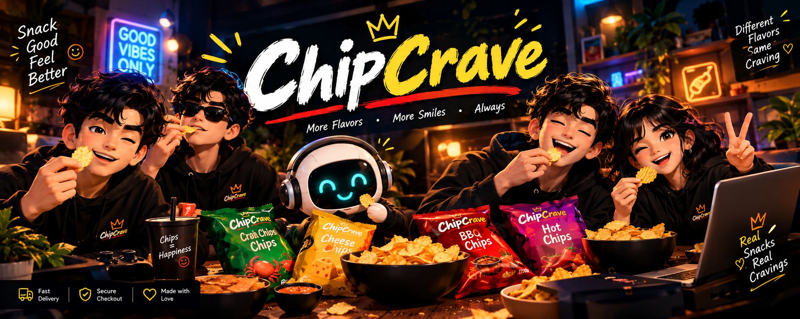
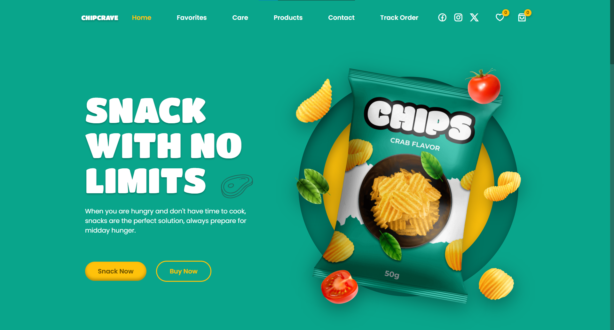
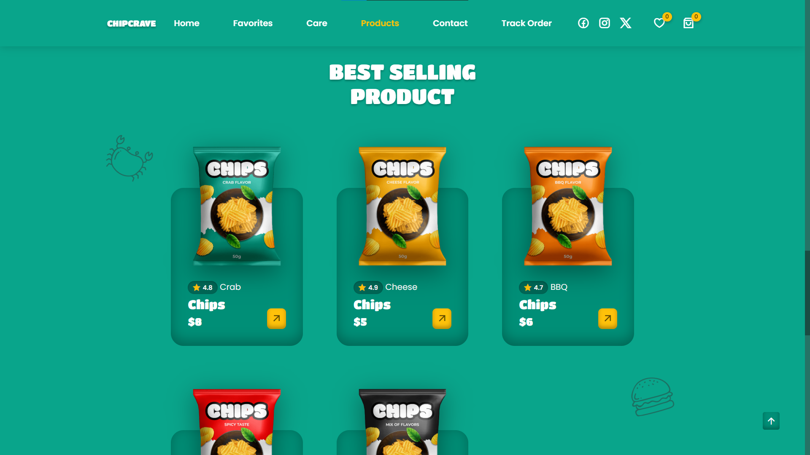
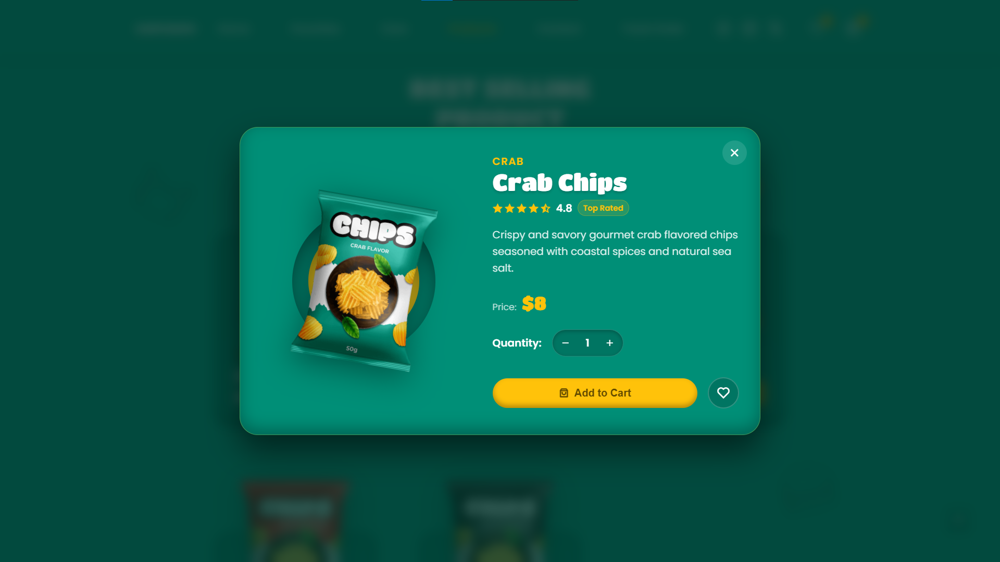
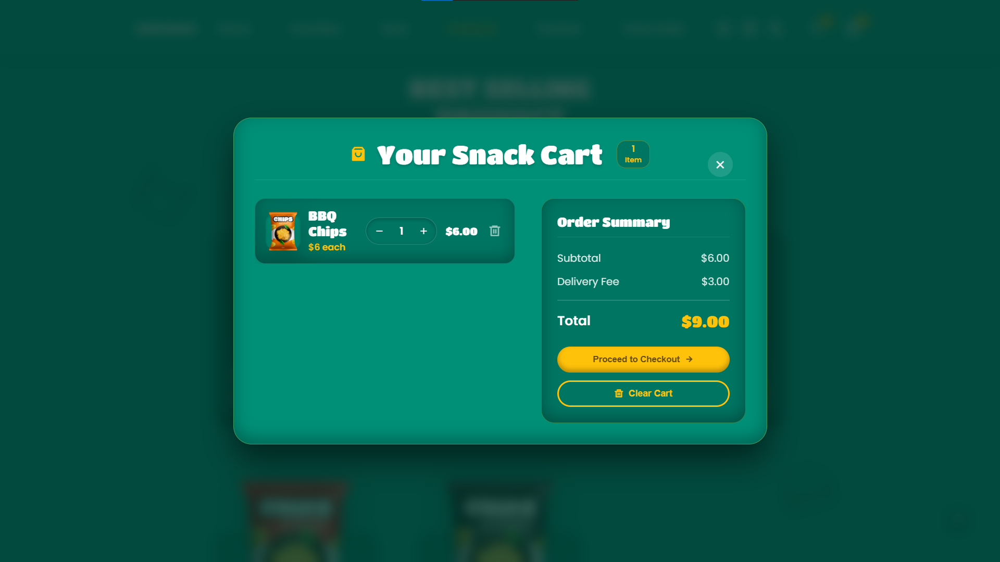
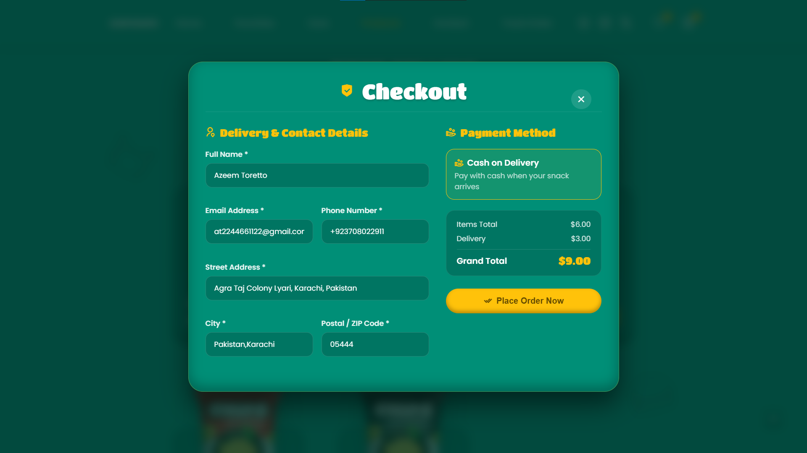
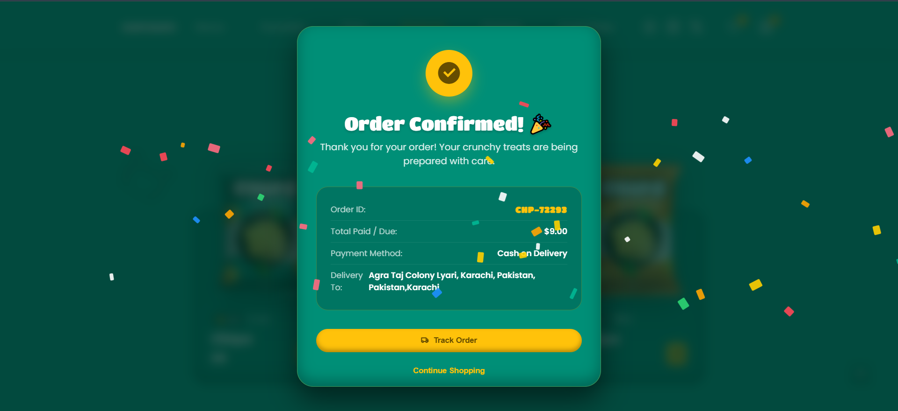
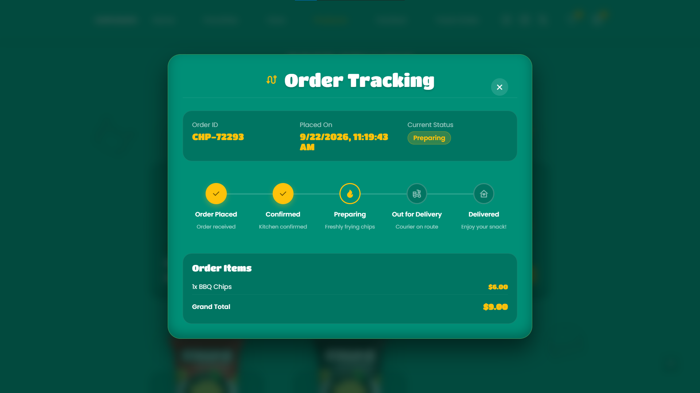
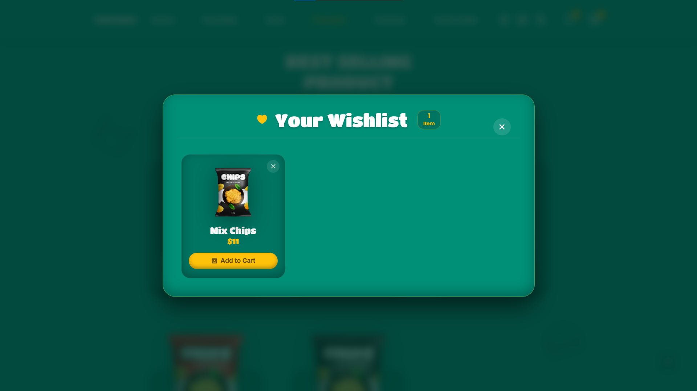
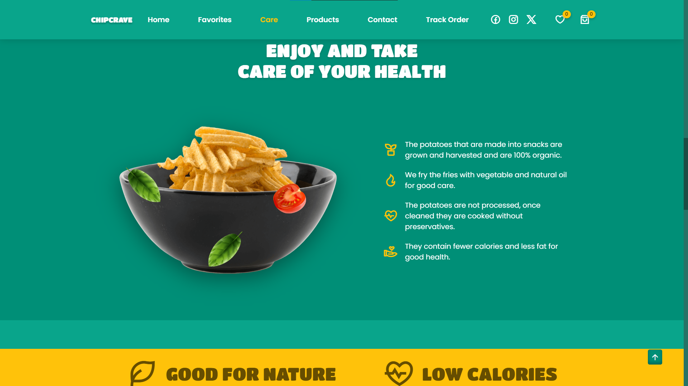

# 🥔 ChipCrave — Premium Chips E-Commerce Experience

<p align="center">
  
</p>

<p align="center">
  <strong>Snack With No Limits 🍟</strong>
</p>

<p align="center">
  A modern, responsive and interactive chips e-commerce experience built with HTML, CSS and JavaScript.
</p>

<p align="center">
  <a href="https://chipcrave.netlify.app/">🌐 Live Demo</a>
  •
  <a href="https://github.com/Azeem-Toretto-1/ChipCrave">💻 Source Code</a>
</p>

---

## 🚀 About The Project

**ChipCrave** is a modern front-end e-commerce website designed around a premium snack-shopping experience.

The project goes beyond a simple landing page and includes an interactive shopping flow where users can explore products, view product details, manage their cart and wishlist, complete a checkout flow, receive an order confirmation and track their order.

The entire experience is built using **HTML, CSS and Vanilla JavaScript**, with responsive layouts and smooth UI interactions.

---

## ✨ Features

* 🏠 Modern and responsive landing page
* 🥔 Premium chips product showcase
* 🔍 Interactive product details modal
* ⭐ Product ratings and pricing
* 🛒 Add to cart functionality
* ➕➖ Cart quantity management
* ❤️ Wishlist functionality
* 💳 Checkout experience
* 💵 Cash on Delivery demo payment flow
* 🎉 Order confirmation experience
* 🧾 Dynamic order summary
* 🚚 Order tracking timeline
* 🔔 Interactive toast notifications
* 📱 Fully responsive design
* 🎨 Smooth UI animations
* ✨ Scroll reveal animations
* 💾 Browser-based storage for cart/wishlist/order data
* 🔝 Smooth scroll-to-top interaction

---

## 🛍️ Shopping Experience

ChipCrave is designed around a complete front-end shopping journey:

```text
Browse Products
      ↓
View Product Details
      ↓
Add To Cart / Wishlist
      ↓
Manage Cart
      ↓
Checkout
      ↓
Place Order
      ↓
Order Confirmation
      ↓
Track Order
```

---

## 📸 Screenshots

### 🏠 Homepage

<p align="center">
  
</p>

### 🛍️ Products

<p align="center">
  
</p>

### 🔍 Product Details

<p align="center">
  
</p>

### 🛒 Shopping Cart

<p align="center">
  
</p>

### 💳 Checkout

<p align="center">
  
</p>

### 🎉 Order Confirmation

<p align="center">
  
</p>

### 🚚 Order Tracking

<p align="center">
  
</p>

### ❤️ Wishlist

<p align="center">
  
</p>

### 🌱 Care & Quality

<p align="center">
  
</p>

---

## 🧰 Tech Stack

### Frontend

| Technology   | Usage                                   |
| ------------ | --------------------------------------- |
| 🧱 HTML5     | Website structure & semantic markup     |
| 🎨 CSS3      | Styling, layouts & responsive design    |
| ⚡ JavaScript | Interactions & e-commerce functionality |

### Libraries & Tools

| Tool             | Purpose                            |
| ---------------- | ---------------------------------- |
| 🎞️ Swiper.js    | Product/flavor slider              |
| ✨ ScrollReveal   | Scroll-based animations            |
| 🎯 Remix Icon    | UI icons                           |
| 💾 Local Storage | Cart, wishlist & order persistence |
| 🌐 Netlify       | Deployment                         |

---

## 📦 Product Collection

ChipCrave currently features multiple chip flavors:

| Flavor          | Rating | Price |
| --------------- | -----: | ----: |
| 🦀 Crab Chips   |  ⭐ 4.8 |    $8 |
| 🧀 Cheese Chips |  ⭐ 4.9 |    $5 |
| 🔥 BBQ Chips    |  ⭐ 4.7 |    $6 |
| 🌶️ Hot Chips   |  ⭐ 4.9 |    $9 |
| 🥔 Mix Chips    |  ⭐ 5.0 |   $11 |

---

## ⚙️ Project Structure

```text
ChipCrave/
│
├── assets/
│   ├── css/
│   │   ├── styles.css
│   │   ├── components.css
│   │   ├── ecommerce.css
│   │   └── responsive.css
│   │
│   ├── img/
│   │   └── ...
│   │
│   └── js/
│       ├── products.js
│       ├── storage.js
│       ├── toast.js
│       ├── modal.js
│       ├── cart.js
│       ├── wishlist.js
│       ├── order.js
│       ├── checkout.js
│       └── main.js
│
├── screenshots/
│   ├── github-baner.png
│   ├── hero.png
│   ├── products.png
│   ├── product-details.png
│   ├── cart.png
│   ├── checkout.png
│   ├── order-confirmation.png
│   ├── order-tracking.png
│   ├── wishlist.png
│   └── care.png
│
└── index.html
```

---

## 🎯 Key JavaScript Modules

The project is organized into separate JavaScript modules to keep the functionality easier to manage and maintain.

### `products.js`

Handles product data including:

* Product names
* Flavors
* Prices
* Ratings
* Product descriptions
* Product images

### `storage.js`

Handles browser storage for persistent front-end data such as:

* Cart
* Wishlist
* Orders

### `cart.js`

Controls:

* Adding products
* Removing products
* Quantity updates
* Cart totals
* Delivery fee
* Order summary

### `wishlist.js`

Handles:

* Adding products to wishlist
* Removing products
* Wishlist rendering
* Wishlist counter

### `checkout.js`

Handles the checkout interface and form validation before placing an order.

### `order.js`

Controls:

* Order creation
* Order ID generation
* Order confirmation
* Order tracking data

### `modal.js`

Manages the different interactive modal experiences throughout the application.

---

## 📱 Responsive Design

ChipCrave is designed to provide a consistent experience across different screen sizes.

```text
Desktop 💻
   ↓
Tablet 📱
   ↓
Mobile 📲
```

The responsive layout adapts navigation, product grids, modals, checkout sections and other UI components for smaller screens.

---

## 🧠 What I Practiced

This project helped me work on:

* Semantic HTML
* Advanced CSS layouts
* CSS Grid & Flexbox
* Responsive web design
* Vanilla JavaScript
* DOM manipulation
* Modular JavaScript architecture
* Event handling
* Modal systems
* Form validation
* Local Storage
* E-commerce UI patterns
* Cart management
* Wishlist management
* Checkout flow
* Order tracking UI
* Interactive animations
* User experience design

---

## 🌐 Live Demo

Experience the complete ChipCrave shopping interface:

<p align="center">
  <a href="https://chipcrave.netlify.app/">
    
  </a>
</p>

---

## 💻 GitHub Repository

<p align="center">
  <a href="https://github.com/Azeem-Toretto-1/ChipCrave">
    
  </a>
</p>

---

## 👨‍💻 About Me

Hi, I'm **Azeem** — a frontend developer focused on building modern, responsive and interactive web experiences.

I'm currently working with:

* HTML
* CSS
* JavaScript

and continuously expanding my skills by building real-world projects and exploring modern web development.

---

## 🤝 Connect With Me

<p align="center">

<a href="https://github.com/Azeem-Toretto-1">
  
</a>

<a href="https://www.linkedin.com/in/azeem-toretto">
  
</a>

<a href="https://www.instagram.com/azeem_dev">
  
</a>

</p>

---

## 📌 Project Links

| 🔗 Platform       | Link                                         |
| ----------------- | -------------------------------------------- |
| 🌐 Live Website   | https://chipcrave.netlify.app/               |
| 💻 GitHub         | https://github.com/Azeem-Toretto-1/ChipCrave |
| 🔗 LinkedIn       | https://www.linkedin.com/in/azeem-toretto    |
| 📸 Instagram      | https://www.instagram.com/azeem_dev          |
| 🐙 GitHub Profile | https://github.com/Azeem-Toretto-1           |

---

## ⭐ Support

If you like this project, feel free to:

⭐ Star the repository
🍴 Fork the project
💬 Share your feedback
🤝 Connect with me

---

## 📄 License

This project was created for **learning, practice and portfolio purposes**.

© 2026 **Azeem-Toretto** — All Rights Reserved.
